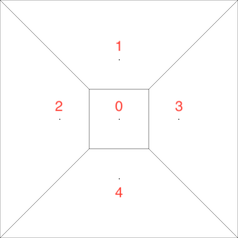
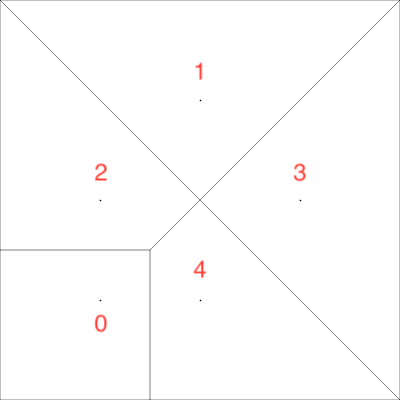

# VAST Test Cases

## VON

### Network Test

The test cases create the following network

Here we have 5 nodes:

1. At (0, 0) is the **gateway** with neighbors (2, 3, 4, 5)
2. At (0, 1) with neighbors (1, 3, 4)
3. At (-1, 0) with neighbors (1, 2, 5)
4. At (1, 0) with neighbors (1, 2, 5)
5. At (0, -1) with neighbors (1, 3, 4)

## Move Node Test

The test case moves node 0 to (-1, -1) from the previous network. This results in the following network:

